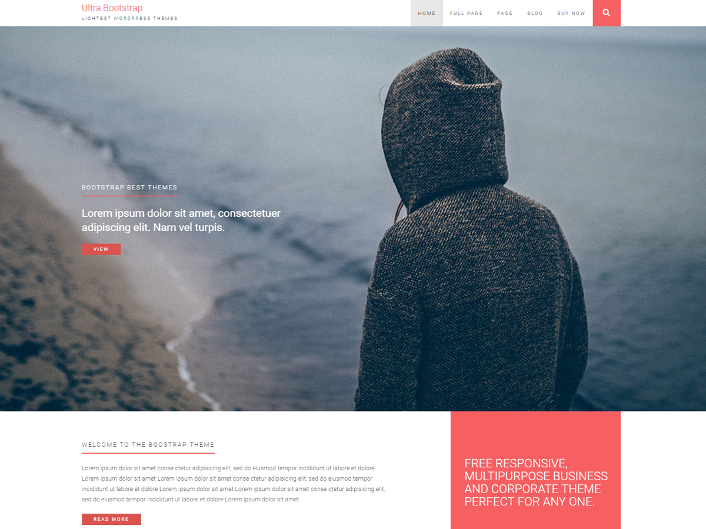

#### See: [Official Demo](https://phantomthemes.com/view?theme=UltraBootstrap) | Read: [Official Docs Page](https://phantomthemes.com/ultrabootstrap-doc/)

# UltraBootstrap Free Bootstrap Wordpress Theme 

Website: [https://phantomthemes.com](https://phantomthems.com)

## About

One of the latest bootstrap wordpress themes includes the Ultrapress Theme. This bootstrap wordpress theme features a slider that displays your most recent or important content. Use eye-catching images to grab your viewer’s attention and entice them to learn more about your page. Set up a blog and display the link at the top of your Ultrapress theme page. Introduce yourself, business or work on a permanent page. Feature key content, images or blog post right on the home page to allow viewers to quickly access the most important information without having to search through pages of content.

The Ultrapress bootstrap WordPress theme allows you to create a visually appealing, professional web page that is mobile friendly and easy to navigate. WordPress offers the best themes for design, customization and user friendliness. For the most professional, quick and convenient way to build your web page WordPress gives you a wide variety of themes. Built on bootstrap you can now create your WordPress page to more easily and conveniently load and properly run on many mobile devices.

## License
UltraBootstrap WordPress Theme, Copyright 2018 Phantom Themes
Ultrabootstrap is distributed under the terms of the GNU General Public License v2.

This program is free software: you can redistribute it and/or modify
it under the terms of the GNU General Public License as published by
the Free Software Foundation, either version 2 of the License, or
(at your option) any later version.

This program is distributed in the hope that it will be useful,
but WITHOUT ANY WARRANTY; without even the implied warranty of
MERCHANTABILITY or FITNESS FOR A PARTICULAR PURPOSE. See the
GNU General Public License for more details.

Requires at least: 4.6
Tested up to: 4.9.8
Stable tag: 1.2.4
License: GPLv2 or later
License URI: http://www.gnu.org/licenses/gpl-2.0.html

## Changelog
See [changelog](CHANGELOG.md)

## Features of UltraBootstrap

-  Mobile Friendly  
Since a majority of people rely on their phones to conduct internet searches, it is important that your page be able to properly adjust on mobile devices.

- Bootstrap Ready  
Using a bootstrap based WordPress theme allows for a quicker loading time and an easy to view layout that adjust to fit the screen it is being accessed on.

- Custom Colors  
The ultrabootstrap bootstrap WordPress theme allows you to create a visually appealing, professional web page that is mobile friendly and easy to navigate.

- Custom Header  
The ultrabootstrap bootstrap WordPress theme allows you to create a visually appealing, professional web page that is mobile friendly and easy to navigate.

- Editor Style  
The ultrabootstrap bootstrap WordPress theme allows you to create a visually appealing, professional web page that is mobile friendly and easy to navigate.

- Grid Layout  
The ultrabootstrap bootstrap WordPress theme allows you to create a visually appealing, professional web page that is mobile friendly and easy to navigate.

## Installation

1. In your admin panel, go to Appearance > Themes and click the Add New button.
2. Click Upload and Choose File, then select the ultrabootstrap.zip file. Click Install Now.
3. Click Activate to use your new theme right away.
4. Create a page "home" or Select the Page Tempalate Called Front Page 
5. Select static frontpage "home" from customizer or Page Created in Step 4
6. Create categories
7. Select category needed for the homepage

## Licenses & Credits

* Based on Underscores http://underscores.me/, (C) 2012-2016 Automattic, Inc., [GPLv2 or later](https://www.gnu.org/licenses/gpl-2.0.html)
* normalize.css http://necolas.github.io/normalize.css/, (C) 2012-2015 Nicolas Gallagher and Jonathan Neal, [MIT](http://opensource.org/licenses/MIT)
* Image description/use : CC0 by CREW, http://www.unsplash.com
* Font-Awesome: fonts, License: SIL OFL 1.1
* Font-Awesome: css, License: MIT License
* Bootstrap: http://getbootstrap.com, License: MIT License
* Google Fonts - Apache License, version 2.0
* wp-bootstrap-navwalker – ​https://github.com/twittem/wp-bootstrap-navwalker, License: Distributed under the terms of the GPL-2.0+ @twittem
* Image licences Used in screenshot, https://unsplash.com/photos/9VPtNW84vGI CC0 License
* {TGM Plugin Activation} library is licensed under the GPL-2.0, https://github.com/TGMPA/TGM-Plugin-Activation/

## Tags: 

full-width-template, two-columns, grid-layout,right-sidebar, custom-logo, theme-options, news, photography, post-formats, footer-widgets, featured-images, rtl-language-support, featured-image-header, custom-menu, flexible-header, editor-style, custom-header, threaded-comments, custom-background, custom-colors, blog

## Frequently Asked Questions

* Does this theme support any plugins ?      
 Yes UltraBootstrap theme supports Contact Form 7 and One Click Demo Import